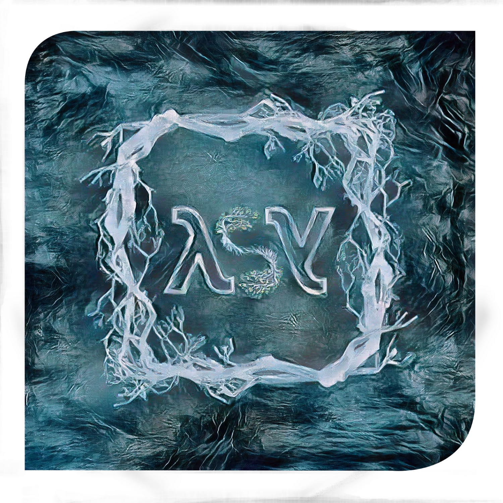

<p align="center">
  
</p>

## The first Symbiotic Functional Language !

Lambda-Symbiosis is a functional language that aims to allow an easier realization of a symbiotic relationship between programming languages of different paradigms. This language is developed within the framework of a master's thesis in computer science and is intended to be an original contribution by its angle of attack concerning a problem not yet solved in the software industry. This language is syntactically simple and concise while not restricting the freedom of programming.

### Markdown

Markdown is a lightweight and easy-to-use syntax for styling your writing. It includes conventions for

```markdown
Syntax highlighted code block

# Header 1
## Header 2
### Header 3

- Bulleted
- List

1. Numbered
2. List

**Bold** and _Italic_ and `Code` text

[Link](url) and 
```

For more details see [Basic writing and formatting syntax](https://docs.github.com/en/github/writing-on-github/getting-started-with-writing-and-formatting-on-github/basic-writing-and-formatting-syntax).

### Jekyll Themes

Your Pages site will use the layout and styles from the Jekyll theme you have selected in your [repository settings](https://github.com/Vdloisem/lambda_symbiosis.github.io/settings/pages). The name of this theme is saved in the Jekyll `_config.yml` configuration file.

### Support or Contact

Having trouble with Pages? Check out our [documentation](https://docs.github.com/categories/github-pages-basics/) or [contact support](https://support.github.com/contact) and we’ll help you sort it out.
